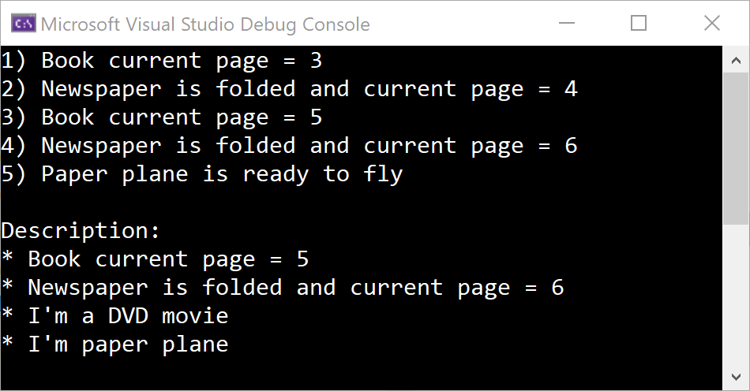

# Interfaces - continued

Add more classes:
- DvdMovie
- PaperPlane

Add new methods:
- FoldAll: fold all elements in the list
- GetDescriptions: get a string with descriptions of the elements

Add necessary interfaces.

The following code:

    var book = new Book();
    book.NextPage();
    book.NextPage();
    Console.WriteLine($"1) {book.Describe()}");

    var newspaper = new Newspaper();
    newspaper.NextPage();
    newspaper.NextPage();
    newspaper.NextPage();
    newspaper.Fold();
    Console.WriteLine($"2) {newspaper.Describe()}");

    var items = new List<IBrowsable> { book, newspaper };

    TwoPagesForward(items);

    Console.WriteLine($"3) {book.Describe()}");
    Console.WriteLine($"4) {newspaper.Describe()}");

    // News stuff:

    var dvd = new DvdMovie();
    var paperplane = new PaperPlane();
    var items2 = new List<IFoldable> { newspaper, paperplane };
    var items3 = new List<IDescribable> { book, newspaper, dvd, paperplane };

    FoldAll(items2);

    if(paperplane.IsReadyToFly)
        Console.WriteLine($"5) Paper plane is ready to fly");
            
    string description = GetDescriptions(items3);
    Console.WriteLine();
    Console.WriteLine(description);

...should give this:

