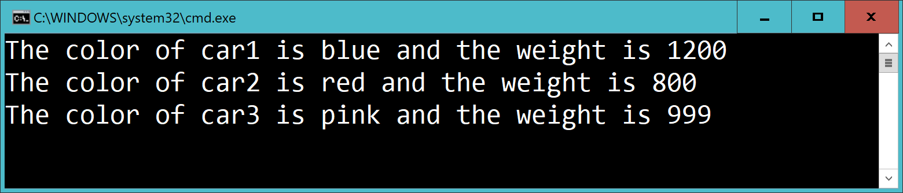

# Car 3

Add two **constructors** for the class Car

This:

    var c1 = new Car("blue", 1200);
    var c2 = new Car("red", 800);
    var c3 = new Car();

    Console.WriteLine($"The color of car1 is {c1.GetColor()} and the weight is {c1.GetWeight()}");
    Console.WriteLine($"The color of car2 is {c2.GetColor()} and the weight is {c2.GetWeight()}");
    Console.WriteLine($"The color of car3 is {c3.GetColor()} and the weight is {c3.GetWeight()}");

...should output:

